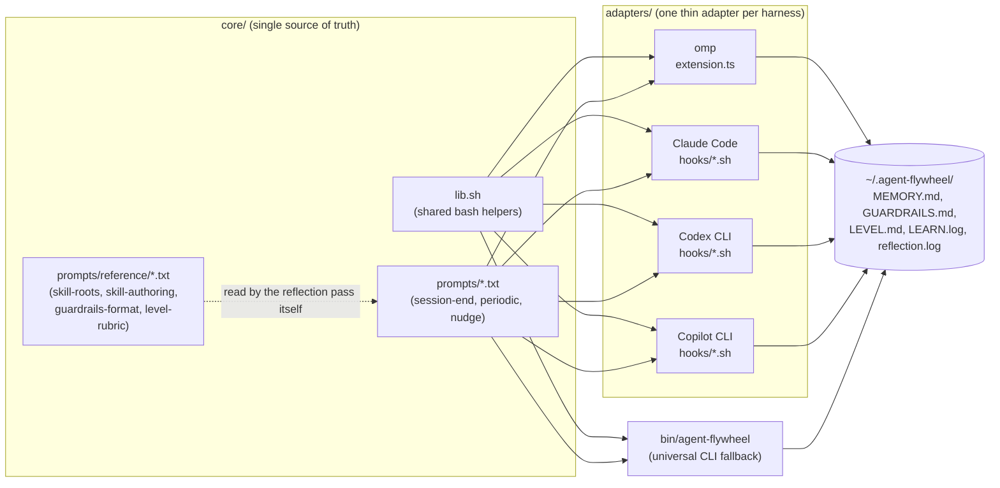
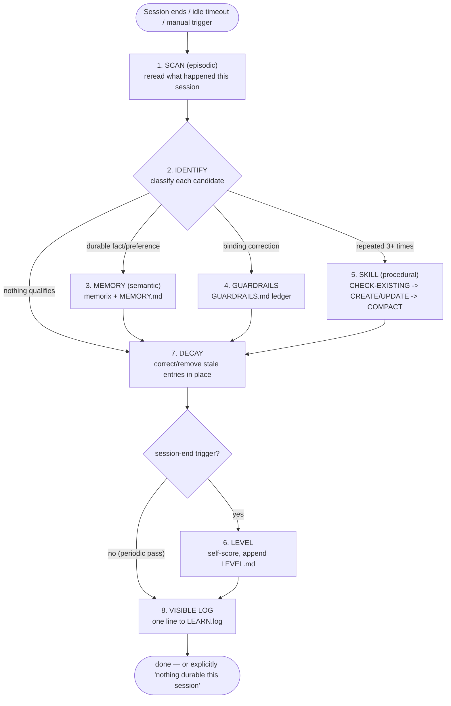

# agent-flywheel

A harness-agnostic **reflect → write → proceduralize** self-improvement loop
for AI coding agents. It makes the "remember what happened, learn from it,
turn repeated work into a reusable procedure" cycle automatic — at session
end, periodically mid-session, and at the very first turn — instead of
depending on a human, or the agent itself, remembering to trigger it.

Ships adapters for four harnesses today (**omp**, **Claude Code**, **Codex
CLI**, **GitHub Copilot CLI**), plus a plain-CLI fallback (`bin/agent-flywheel`)
that works with literally anything that can run a shell command — see
[`adapters/generic/README.md`](adapters/generic/README.md).

## Why this exists

Every AI coding harness eventually reinvents the same three things: a way to
persist what an agent learned past its context window, a way to nudge it
toward disciplined habits at the start of a task, and a way to keep doing
both without a human remembering to ask. Most harnesses ship none of this,
or ship it as one proprietary plugin tied to one tool. agent-flywheel is the
harness-agnostic version: the prompts and logic live in one place
(`core/`), and each harness gets a thin adapter that wires its own
hook/event system to the same shared files — so the behavior is identical
everywhere and never drifts into four slowly-diverging copies.

## Prerequisites

Zero required prerequisites beyond `bash`, `node`, and (Claude Code adapter
only) `jq` — the loop runs standalone. The one thing worth setting up
deliberately is **durable memory**, which is why it's documented as a
first-class prerequisite in [`docs/prerequisites.md`](docs/prerequisites.md):

- **Where memory lives (central, not per-project).** All state —
  `MEMORY.md`, `GUARDRAILS.md`, `LEVEL.md`, `LEARN.log`, `SELF-IMPROVE.md` —
  lives in one fixed directory, `~/.agent-flywheel` (override with
  `AGENT_FLYWHEEL_HOME`), **independent of your working directory**. Changing
  `cd` between projects never moves or splits it; a lesson learned in one repo
  is read in every other. Point `AGENT_FLYWHEEL_HOME` at a synced folder to
  share one memory across machines.
- **memorix (recommended, optional).** When memorix (or claude-mem) is
  reachable, it's the *primary* semantic store — cross-project, searchable, the
  harness-agnostic memory this loop is built to cooperate with — and
  `MEMORY.md` is still written as the always-portable baseline. Check which is
  active with `agent-flywheel memory --status`.

Full detail, per-harness setup, and the "used when present, fallback otherwise"
skill table: [`docs/prerequisites.md`](docs/prerequisites.md). Prior-art and
what's borrowed from Reflexion/CoALA/Voyager/MemGPT/Hermes:
[`docs/prior-art.md`](docs/prior-art.md).

## Architecture

```
core/
  lib.sh                    shared bash helpers every adapter hook sources
  prompts/
    session-end.txt         reflection procedure run when a session ends
    periodic.txt            lightweight version run on an idle mid-session timer
    maturity-nudge.txt       first-turn habits nudge (spec-first, verify-gate, delegate)
    self-improve.txt         META pass: the loop reflects on and improves ITSELF
                              (its prompts, adapters, guardrail effectiveness,
                              level trend, next-skill curriculum) + self-heal first
    reference/               fallback docs read by session-end.txt when the user's
                              own dedicated skill (skill-creator, learn-from-session,
                              level-up-coach, ...) isn't installed:
      skill-roots.txt         where to look for existing skills (CHECK-EXISTING)
      skill-authoring.txt     SKILL.md frontmatter contract + CREATE/UPDATE/COMPACT steps
      guardrails-format.txt   numbered-ledger format for binding corrections
      level-rubric.txt        L2-L5 self-scoring rubric for the LEVEL step
      project-rules.txt        global-vs-project level routing: where a learned
                              rule belongs (personal store vs the repo's own
                              AGENTS.md/CLAUDE.md) so the harness learns per-project
scripts/
  advisor-autotune.mjs      deterministic auto-tune for omp's native advisor subsystem
  idle-gap.mjs              idle/rate-limit check for harnesses with no native timer
  skill-scaffold.mjs        generic SKILL.md scaffolder + lister (skill new/list fallback)
bin/
  agent-flywheel            universal CLI — see `agent-flywheel help` for the full list:
                              nudge | prompt | reflect | skill new/list | log |
                              memory [--status] | doctor [--heal] | self-improve |
                              periodic-check | periodic-mark | autotune
.claude-plugin/             Claude Code plugin manifest (single-add install path)
  plugin.json               plugin manifest (hooks + commands, points at core/)
  marketplace.json          marketplace entry for `claude plugin marketplace add`
hooks/hooks.json            plugin SessionStart/SessionEnd -> the same adapter scripts
commands/                   slash commands: /flywheel-reflect, -nudge, -self-improve
skills/                     bundled skill: flywheel-skill-lifecycle (spec->create->compact)
config.env.example          cadence + memory-location config, seeded on install
adapters/
  omp/                      extension (before_agent_start nudge, session hooks) + rules + config
  claude-code/               SessionStart/SessionEnd hooks + settings.json snippet
  codex/                     session-end hook + notes on what's verified vs not
  copilot/                   session-end hook + notes on what's verified vs not
  generic/                   wiring guide for anything else (Cursor, Windsurf, Aider, ...)
install.sh / uninstall.sh    idempotent installer/uninstaller for every detected harness
tests/                       node --test unit tests + install/uninstall idempotency smoke test
```

**Session-end reflection.** Every harness here is fire-and-forget at
session-end (no hook can force "one more turn" in a closing session), so
every adapter spawns a detached, headless subprocess that resumes the
transcript that just ended and runs the shared `session-end.txt` procedure
against it, guarded by an `AGENT_FLYWHEEL_PASS=1` env var so the spawned
reflection pass's own session-end doesn't spawn another one recursively.

**Periodic mid-session checkpoint.** A session left open and idle for hours
would otherwise never get a reflection pass until it finally closes.
Harnesses with a native background-timer primitive (omp's extension API)
arm it directly; harnesses without one get `scripts/idle-gap.mjs`, a small
dependency-free Node script wired into the harness's own hook system on a
poll interval, rate-limited across every running harness on the machine by
one shared marker file so leaving many terminals open doesn't multiply cost.

**First-turn maturity nudge.** `core/prompts/maturity-nudge.txt` — spec
first for ambiguous/multi-file work, delegate genuinely reusable sub-work,
verify before claiming done, prefer the boring existing pattern — injected
once per session via whatever first-turn/system-prompt mechanism the
harness exposes (omp: `before_agent_start`; Claude Code: `SessionStart`
`additionalContext`; anything else: `bin/agent-flywheel nudge`).

**Advisor auto-tune (omp only).** `scripts/advisor-autotune.mjs`
deterministically disables omp's native second-model advisor subsystem if
it has reviewed a real sample of sessions (default: 8) and never once
raised anything above a "nit" — i.e., it isn't earning its own API cost.
This is a mechanical count, not an LLM instruction, on purpose: a config
flip that depends on a model "remembering" to check a condition is exactly
the kind of thing that should be code instead.





## Invocation Reference

Every trigger below runs the exact same `core/prompts/*.txt` procedure; only
*how it gets invoked* differs per harness.

| Trigger | omp | Claude Code | Codex CLI | Copilot CLI | Anything else |
|---|---|---|---|---|---|
| **Automatic, session end** | `session_switch`/`session_shutdown` extension hooks spawn a detached `omp -p` | `SessionEnd` hook spawns a detached `claude -p --resume` | Manual wiring — `adapters/codex/hooks/session-end.sh` ready to call, see `notes.md` | Manual wiring — `adapters/copilot/hooks/session-end.sh` ready to call, see `notes.md` | n/a — trigger `agent-flywheel reflect --session <path>` from whatever hook your tool offers |
| **Periodic, mid-session idle** | `ctx.setInterval` in the extension, gated by `scripts/idle-gap.mjs`-equivalent logic inline | `adapters/claude-code/hooks/periodic-watcher.sh` (external poll loop) | Not wired — no confirmed native timer hook; use `agent-flywheel periodic-check` from cron/a watcher | Same as Codex | `agent-flywheel periodic-check --transcript <path>` wired into any poll mechanism (cron, watcher script) |
| **First-turn nudge** | `before_agent_start` extension hook, `additionalContext`-style system message | `SessionStart` hook, `additionalContext` | Not wired — paste `agent-flywheel nudge` output into your own first-turn context | Not wired — same as Codex | `agent-flywheel nudge` — pipe into AGENTS.md, a system prompt, or read it yourself before starting |
| **Manual / on-demand** (before `/new`, `/clear`, or right now) | `agent-flywheel reflect` (no `--session`) prints the prompt for your *current* live session to follow inline | Same | Same | Same | Same — this is the harness-agnostic universal fallback for every trigger above |

`agent-flywheel reflect --session <path> --harness <name> --print` always
shows the exact command instead of running it — the same one-liner
`spawn_harness_resume()` in `bin/agent-flywheel` and each adapter's hook
script would otherwise spawn detached, letting you debug or wire it into
a mechanism this project doesn't ship an adapter for yet.

## What this bundles (and what it replaces)

agent-flywheel is deliberately a **reimplementation, not a bundle** — zero
runtime dependencies beyond `bash`, `node`, and (for the Claude Code
adapter) `jq`, so it works the same on a fresh machine as on one with every
AI tool already installed. It replaces the ad-hoc habit of *hoping* an
agent remembers to reflect, self-correct, or turn a repeated workflow into
a skill — the loop runs automatically, the same way, on every harness.

It deliberately does **not** replace a dedicated skill you already use for
one stage of the pipeline. If `memorix`/`claude-mem`, `skill-creator`,
`learn-from-session`, or `level-up-coach` are installed and reachable, the
shared prompts in `core/prompts/*.txt` say so explicitly and degrade to
them as the preferred path for that stage — the `core/prompts/reference/*`
fallback docs (skill-roots, skill-authoring, guardrails-format,
level-rubric) only take over when nothing dedicated is present. Nothing
here is meant to gate you away from a skill you already have; the goal is
that the loop still works with zero setup when you don't.

## What engineers usually miss

- **A closing/switching session cannot run "one more turn."** Every
  adapter's session-end path spawns a *new*, detached, headless subprocess
  against the transcript that just ended, guarded by
  `AGENT_FLYWHEEL_PASS=1` so that subprocess's own eventual exit doesn't
  recursively spawn another reflection pass.
- **`--resume` does not preload the old conversation.** The prompt text
  says this explicitly on purpose: a reflection pass's context starts
  blank even though it resumed the ended session's ID — it must read the
  transcript file directly, not assume it's already in context.
- **macOS ships bash 3.2** (no `mapfile`/`readarray`) as `/bin/bash` by
  default. `spawn_harness_resume()` in `bin/agent-flywheel` is four plain
  `case` branches instead of a generic argv-array abstraction for exactly
  this reason — don't "simplify" it into something that needs bash 4+.
- **Reflection/child-process output is never silently discarded.** Every
  detached spawn (adapter hooks and the omp extension alike) redirects
  stdout/stderr to `~/.agent-flywheel/reflection.log`, not `/dev/null` —
  a silently-failing reflection pass is worse than a visible one.
- **`--print` exists for a reason.** It reconstructs the exact same
  shell-quoted command the real detached spawn would run (via bash's
  `printf %q`), so you can verify a prompt/session round-trips correctly
  — including embedded newlines and special characters — before trusting
  the backgrounded version.
- **Codex and Copilot are intentionally not auto-wired.** Their hook
  schemas weren't confirmed against real, current CLI behavior while
  building this project; shipping an unverified auto-wire step would be
  worse than printing manual instructions. See each adapter's `notes.md`.

## Research grounding

The reflect → write → proceduralize procedure in `core/prompts/*.txt` is
the standard reflection-agent pattern from the agent-memory literature, not
ad-hoc summarizing:

- **Reflexion** (Shinn et al., 2023, [arXiv:2303.11366](https://arxiv.org/abs/2303.11366)) — verbal self-reflection on
  past episodes, stored and reused as linguistic feedback for future
  attempts, without any weight updates.
- **CoALA: Cognitive Architectures for Language Agents** (Sumers et al.,
  2023, [arXiv:2309.02427](https://arxiv.org/abs/2309.02427)) — the
  episodic / semantic / procedural memory decomposition this project's
  SCAN → REFLECT → WRITE → PROCEDURALIZE steps map onto directly: episodic
  (what happened this session), semantic (durable facts/preferences,
  written to `~/.agent-flywheel/MEMORY.md`), procedural (repeated
  multi-step workflows turned into a skill/script).
- **Generative Agents** (Park et al., 2023, [arXiv:2304.03442](https://arxiv.org/abs/2304.03442)) —
  memory decay/consolidation informing this project's DECAY step: a
  stale, contradicted memory is actively corrected in place, not left to
  accumulate alongside a newer contradicting entry.

## Install

Two ways in. The **plugin** is the single-add path for Claude Code; **`install.sh`**
is the universal path that also wires omp and the CLI. They can coexist, but pick
one per harness so a hook isn't registered twice (see "Avoiding double-wiring").

### Option A — `install.sh` (all harnesses: omp, Claude Code, CLI)

```bash
git clone https://github.com/abhishekgarg18/agent-flywheel.git
cd agent-flywheel
./install.sh              # detect + wire every harness found on this machine
./install.sh --dry-run     # see what it would do first, without touching anything
./install.sh --only omp    # or --only claude-code, to wire just one
```

Also seeds `~/.agent-flywheel/config.env` from `config.env.example` (never
overwrites an existing one), so cadence/memory config is ready to edit.

### Option B — Claude Code plugin (single add, Claude Code only)

Packages the same hooks + the same `core/` prompts as one installable plugin,
plus three slash commands (`/flywheel-reflect`, `/flywheel-nudge`,
`/flywheel-self-improve`) and the bundled `flywheel-skill-lifecycle` skill:

```text
/plugin marketplace add abhishekgarg18/agent-flywheel      # add this repo as a marketplace
/plugin install agent-flywheel@agent-flywheel               # install the plugin
# local checkout, for testing without installing:
claude --plugin-dir /path/to/agent-flywheel
```

The plugin's hooks reference the same adapter scripts and `core/` prompts via
`${CLAUDE_PLUGIN_ROOT}`, so there is no second copy of the logic. Durable state
still lives in `~/.agent-flywheel`, shared with every other harness.

### Self-heal and the meta pass

- `agent-flywheel doctor --heal` re-syncs any deleted/corrupted managed file
  from the recorded source checkout and re-wires every harness, then re-checks —
  so drift in the loop's own wiring is repaired, not silently tolerated.
- The loop improves **itself**, not only your sessions: on a configurable
  cadence (default: at session-end, at most weekly) it runs the META pass in
  `core/prompts/self-improve.txt` — auto-heal, then assess its own prompts,
  guardrail effectiveness, level trend, and next-skill curriculum. Tune when it
  fires in `config.env` (see [Configuration](#configuration)). It **proposes**
  changes to its own machinery in `SELF-IMPROVE.md`; it never silently rewrites
  a live prompt with no review.

### Where lessons are written (global vs project)

The reflection pass routes each lesson to the right **level** so it lands where
it's actually needed (`core/prompts/reference/project-rules.txt`):

- **Global** (how you work everywhere): your personal, machine-global store —
  `~/.agent-flywheel/MEMORY.md` + `GUARDRAILS.md` (and memorix when reachable),
  plus your global agent-instructions file if you keep one.
- **Project** (this repo, any contributor, any harness): the repository's **own
  `AGENTS.md`/`CLAUDE.md`** (a "Learned rules" section), so a teammate who never
  installed agent-flywheel still inherits the convention.

This is what makes the harness itself learn — not just your private store —
at both levels.

### Avoiding double-wiring

If you already have another self-improvement/reflection loop wired into a
harness (your own SessionStart/SessionEnd hooks, or a prior manual wiring),
remove it before installing agent-flywheel into that harness, or both will fire
a reflection pass on every session. `./uninstall.sh` removes agent-flywheel's
own wiring cleanly; a pre-existing loop from another source you remove by hand.

`install.sh` syncs this repo to `~/.agent-flywheel` and then, for each
harness it detects:

| Harness | What gets wired automatically |
|---|---|
| **omp** | Extension + rules copied into `~/.omp/agent/`; `WATCHDOG.md`/`WATCHDOG.yml` seeded only if absent (never overwrites your customization); `config.yml`'s `advisor:` block merged in idempotently via marker comments |
| **Claude Code** | `SessionStart`/`SessionEnd` hooks merged into `~/.claude/settings.json` via `jq` (idempotent — re-running updates, never duplicates) |
| **Codex CLI** | Not auto-wired — printed manual instructions. Codex's `additionalContext`/background-timer hook schema was never confirmed while building this, so this project doesn't ship an unverified auto-wire step. See [`adapters/codex/notes.md`](adapters/codex/notes.md). |
| **GitHub Copilot CLI** | Same as Codex — manual instructions only. See [`adapters/copilot/notes.md`](adapters/copilot/notes.md). |
| **Anything else** | `bin/agent-flywheel nudge` / `prompt` / `periodic-check` are plain CLI primitives with zero harness assumptions. See [`adapters/generic/README.md`](adapters/generic/README.md). |

Only two config files are ever mutated, and only inside markers or via a
scoped `jq` filter targeting exact command strings — nothing else in either
file is touched, and re-running `install.sh` after a `git pull` is always
safe.

```bash
./uninstall.sh              # unwire from every harness, keep ~/.agent-flywheel (logs/markers)
./uninstall.sh --purge      # also delete ~/.agent-flywheel entirely
```

## Session boundaries per harness

The loop must fire on every way a session can end — and those differ per
harness. Both fully-supported harnesses are covered:

| Close path | omp | Claude Code |
|---|---|---|
| **Normal end / exit** (Ctrl-D, `/exit`, close terminal) | `session_shutdown` → reflection pass | `SessionEnd` (reason `exit`/`logout`) → reflection pass |
| **`/new`** (start a fresh session) | `session_switch` (reason `new`, carries previous session file) → reflection pass on the previous session | `SessionEnd` (reason `clear`) on the old session, then `SessionStart` re-arms | 
| **`/clear`** | no lifecycle event (in-place marker only) — nothing to hook, by design of omp's event model | `SessionEnd` (reason `clear`) → reflection pass, then `SessionStart` re-injects the nudge |
| **First turn** | `before_agent_start` → maturity nudge + active guardrails | `SessionStart` `additionalContext` → maturity nudge + active guardrails |
| **Idle mid-session** | `ctx.setInterval` idle checkpoint (config-driven) | detached `periodic-watcher.sh` (config-driven) |

Every path spawns a **detached** reflection subprocess (no hook can force "one
more turn" in a closing session) guarded by `AGENT_FLYWHEEL_PASS=1` against
recursive self-spawn. omp's `/clear` intentionally has no hook because omp emits
no event for it; on Claude Code `/clear` does fire `SessionEnd`, so it's covered
there. Both read the same `config.env` for cadence, so tuning applies uniformly.

## Configuration

Everything has a working default; `install.sh` seeds
`~/.agent-flywheel/config.env` from [`config.env.example`](config.env.example)
(never overwriting an existing one). Precedence: a shell env var of the same
name → `config.env` → the built-in default. Full reference:
[`docs/configuration.md`](docs/configuration.md).

Most-tuned knob — **when the meta self-improvement pass fires**:

| `AGENT_FLYWHEEL_SELF_IMPROVE_MODE` | Effect |
|---|---|
| `every-session` | run the meta pass at every eligible trigger |
| `gap` *(default)* | at most once per `…_GAP_DAYS` (default 7) |
| `days` | only on `…_DAYS` (e.g. `Sat,Sun`, or `1,4`) |
| `off` | never auto-run — manual `agent-flywheel self-improve` only |

`AGENT_FLYWHEEL_SELF_IMPROVE_TRIGGER` = `session-end` (default) / `mid-session` /
`both` chooses which point may run it. Periodic-checkpoint timing
(`…_PERIODIC_CHECK_SECONDS`, `…_IDLE_SECONDS`, `…_MIN_PERIODIC_GAP_SECONDS`) is
read by both harnesses. Verify with `agent-flywheel self-improve --gate; echo $?`
(0 = due now) and `agent-flywheel memory --status`.

## Testing

```bash
node --test                        # unit tests: advisor-autotune, idle-gap, skill-scaffold, reflect --print dispatch, self-improve cadence gate, install-preserves-state
./tests/install-idempotency.sh     # sandboxed install/uninstall smoke test, incl. doctor + reflect --print (never touches your real config)
shellcheck adapters/*/hooks/*.sh core/lib.sh install.sh uninstall.sh bin/agent-flywheel --exclude=SC1091
```

All three run in CI on every push/PR — see
[`.github/workflows/ci.yml`](.github/workflows/ci.yml).

## Contributing

The Codex and Copilot adapters ship only what was verified against each
CLI's actual documented hook behavior while building this project — see the
"Not wired here" section of each adapter's `notes.md` for exactly what's
still missing (a session-start/`additionalContext` equivalent and a native
periodic-checkpoint hook) and why it's a deliberate omission, not an
oversight. PRs that confirm the real schema and close that gap are welcome.

## License

MIT — see [LICENSE](LICENSE).
